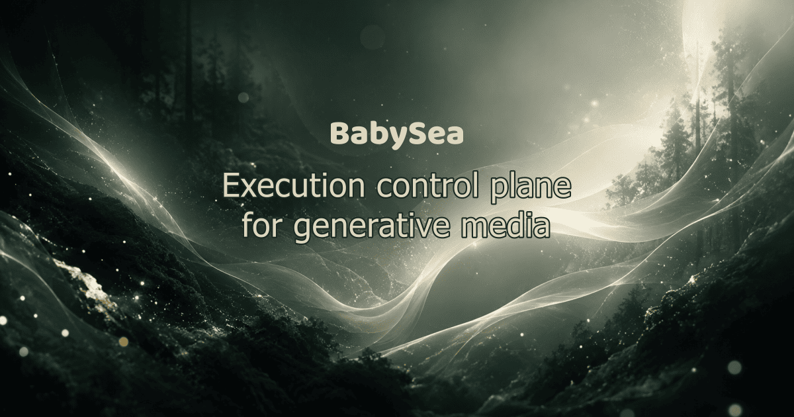
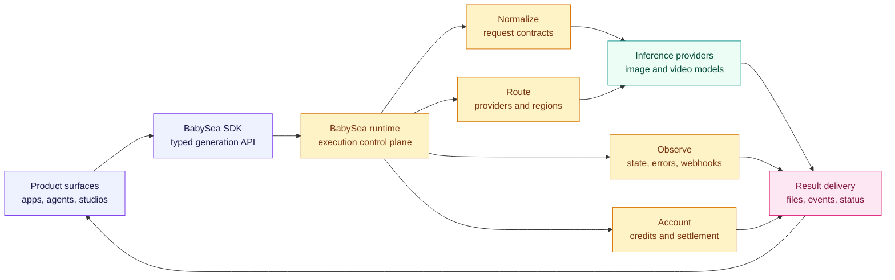
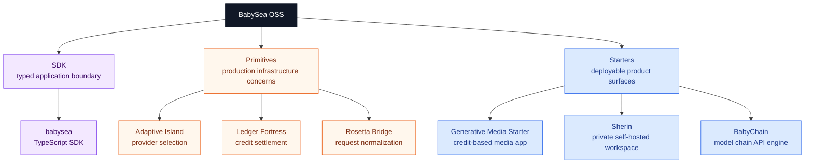

<div align="center">

<p>
  
</p>

<h1>
  Execution control plane for generative media
</h1>

<p>
  <strong>Authenticate, validate, rate limit, reserve credits, select providers, execute workloads, fail over, persist artifacts, and deliver results through one control plane.</strong>
</p>

<br />

[](https://babysea.ai)
[](https://docs.babysea.ai)
[](https://babysea.ai/model-schema)
[](https://us.babysea.ai/playground)
[](https://us.babysea.ai/playground)

<br />



</div>

<br />

## Why BabySea exists

Generative media is moving from demos into product surfaces: image editors, design tools, marketing workflows, video pipelines, creator apps, agentic media systems, and internal production studios.

The hard part is no longer calling one model. The hard part is operating generation across providers, regions, schemas, prices, failures, webhooks, storage, credits, and user expectations.

BabySea turns that execution layer into infrastructure. Developers send one typed request and get a consistent lifecycle from request to result, while BabySea handles the provider-facing complexity behind the runtime boundary.

## Runtime map



## What BabySea standardizes

| Layer | What it standardizes | Why it matters |
| :--- | :--- | :--- |
| **API** | Generation create, retrieve, cancel, delete, and observe flows | Product teams build against one contract instead of provider-specific APIs. |
| **Runtime** | Provider routing, failover, lifecycle state, errors, and delivery behavior | Workloads stay predictable even when providers differ. |
| **SDK** | Typed JavaScript and TypeScript integration through [`babysea`](https://www.npmjs.com/package/babysea) | Teams ship faster with a clean application boundary. |
| **Webhooks** | Signed generation lifecycle events | Downstream systems can react reliably to async media jobs. |
| **Operations** | Regional endpoints, status visibility, trust posture, and documented failure modes | Generative media becomes something teams can run, not just call. |

## Open source system

BabySea OSS is where we publish reusable parts of the execution control plane: the SDK surface, infrastructure primitives, and deployable starters.



## BabySea OSS taxonomy

BabySea open source projects are organized into three categories:

[](#babysea-oss-taxonomy)
[](#babysea-oss-taxonomy)
[](#babysea-oss-taxonomy)

| Category      | Description                                                                                                                                       |
| :------------ | :------------------------------------------------------------------------------------------------------------------------------------------------ |
| **SDK**       | Typed developer entry points for creating, tracking, and managing BabySea workloads from application code.                                        |
| **Primitive** | Reusable infrastructure boundaries extracted from BabySea's execution control plane. Each primitive focuses on one system concern.                |
| **Starter**   | Deployable reference applications that combine product UI, auth, storage, and BabySea execution patterns. Some starters may also include billing. |

## Status

BabySea OSS projects are published into three status levels:

[](#status)
[](#status)
[](#status)

| Status         | Description                                                                                                                                                                          |
| :------------- | :----------------------------------------------------------------------------------------------------------------------------------------------------------------------------------- |
| **Working**    | Fully implemented and deployable. All documented capabilities function as described. Suitable for personal and small-team use. No breaking-change guarantees between versions.       |
| **Production** | Working plus a hardened public runtime contract. Validated against a stated infrastructure stack with deterministic behavior, explicit failure modes, and a documented upgrade path. |
| **Alpha**      | Early-stage implementation. Core structure exists but some capabilities may be incomplete, undocumented, or subject to breaking changes. Not recommended for production deployments. |

## Portfolio

| Project | Taxonomy | Status | Boundary |
| :--- | :--- | :--- | :--- |
| [`babysea`](https://www.npmjs.com/package/babysea) | SDK | Production | Typed JavaScript and TypeScript client for BabySea generation workflows. |
| [Adaptive Island](https://github.com/babysea-community/adaptive-island) | Primitive | Production | Cache-first provider selection engine for multi-provider inference workloads. |
| [Ledger Fortress](https://github.com/babysea-community/ledger-fortress) | Primitive | Production | Atomic credit settlement engine for async inference workloads. |
| [Rosetta Bridge](https://github.com/babysea-community/rosetta-bridge) | Primitive | Production | Request normalization engine for multi-provider inference workloads. |
| [Generative Media Starter](https://github.com/babysea-community/generative-media-starter) | Starter | Working | Credit-based generative media app starter with auth, prepaid credits, and private storage. |
| [Sherin](https://github.com/babysea-community/sherin) | Starter | Working | Self-hosted private workspace for generative media with own key, domain, and storage. |
| [BabyChain](https://github.com/babysea-community/babychain) | Starter | Alpha | Model chain API engine for image and video workloads with one durable pipeline and one final callback. |

## Quickstart

Install the TypeScript SDK:

```bash
npm install babysea
```

Keep write-capable API keys server-side.

Create a generation:

```ts
import { BabySea } from 'babysea';

const client = new BabySea({
  apiKey: process.env.BABYSEA_API_KEY!,
  region: 'us',
});

const generation = await client.generate('bfl/flux-schnell', {
  generation_prompt: 'A cinematic studio product shot of a ceramic espresso cup',
  generation_provider_order: 'fastest',
});

console.log(generation.data.generation_id);
```

Wait for the result:

```ts
const completed = await client.waitForGeneration(
  generation.data.generation_id,
  { timeout: 120_000, interval: 2_000 },
);

console.log(completed.data.generation_status);
console.log(completed.data.generation_output_file);
```

Full guide: [docs.babysea.ai/quickstart](https://docs.babysea.ai/quickstart)

## Built for builders who need more than a model call

| Need | BabySea posture |
| :--- | :--- |
| Ship generation features quickly | Typed SDK, playground, generated cURL, and reference starters. |
| Avoid provider lock-in | Public request contracts and provider-aware execution boundaries. |
| Run async media safely | Lifecycle states, signed webhooks, structured errors, and cancellation support. |
| Control cost and reliability | Provider ordering, routing intelligence, failover patterns, and credit-aware primitives. |
| Operate globally | Regional APIs for US, EU, and APAC workloads. |

## Regions

| Region | Playground | API |
| :--- | :--- | :--- |
| US | [https://us.babysea.ai/playground](https://us.babysea.ai/playground) | `https://api.us.babysea.ai/v1` |
| EU | [https://eu.babysea.ai/playground](https://eu.babysea.ai/playground) | `https://api.eu.babysea.ai/v1` |
| APAC | [https://jp.babysea.ai/playground](https://jp.babysea.ai/playground) | `https://api.jp.babysea.ai/v1` |

Choose the region closest to your users, compliance needs, or provider availability.

## Trust and operations

BabySea is designed for production generative media workloads. Public operational surfaces include regional endpoints, API key authentication, structured errors, signed webhooks, rate limits, status visibility, and a trust center.

| Surface | Link |
| :--- | :--- |
| Trust Center | [trust.babysea.ai](https://trust.babysea.ai) |
| Status | [status.babysea.ai](https://status.babysea.ai) |
| Documentation | [docs.babysea.ai](https://docs.babysea.ai) |
| Playground | [us.babysea.ai/playground](https://us.babysea.ai/playground) |
| npm | [babysea](https://www.npmjs.com/package/babysea) |
